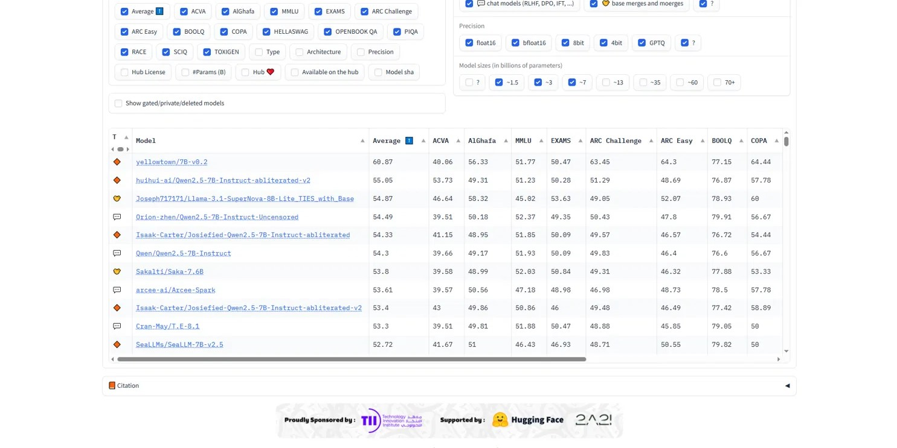
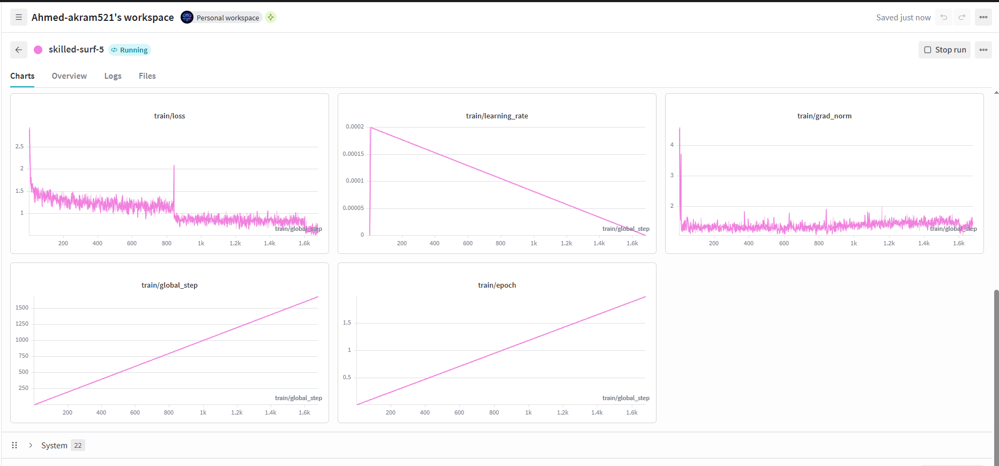
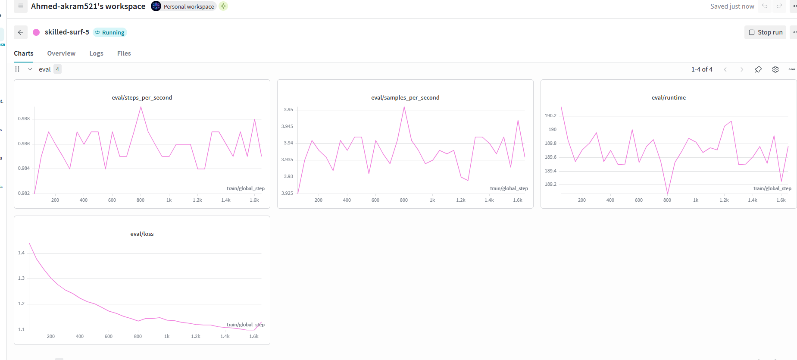
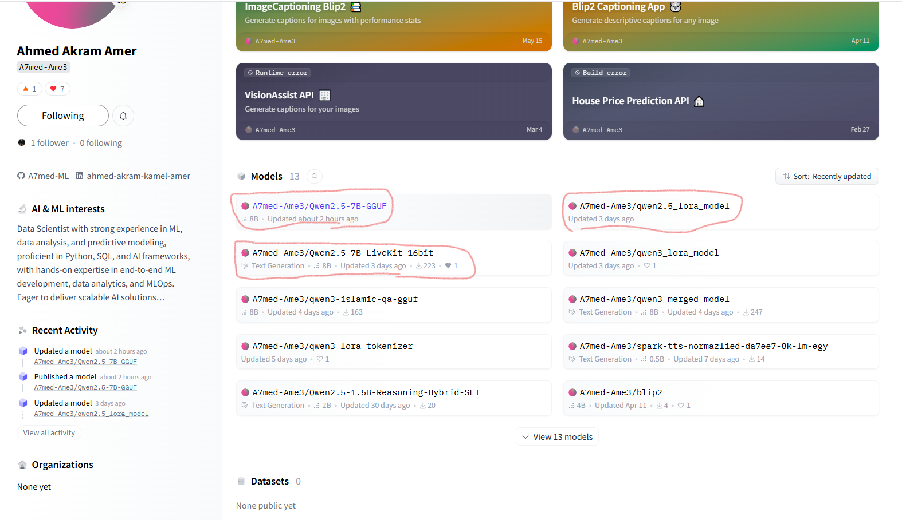

# ARCHITECTURE.md — Egyptian Dialect Islamic Q&A Assistant

## Links

| Resource                 | Link                                                                                                       |
| ------------------------ | ---------------------------------------------------------------------------------------------------------- |
| 🎥 Live Demo             | [Watch on Google Drive](https://drive.google.com/file/d/1BRYskrCp0Qf4y649rONq1XTpNDMA57-9/view?usp=sharing) |
| 🔧 LoRA Adapter          | [A7med-Ame3/qwen2.5_lora_model](https://huggingface.co/A7med-Ame3/qwen2.5_lora_model)                       |
| 🧩 Merged Model (16-bit) | [A7med-Ame3/Qwen2.5-7B-LiveKit-16bit](https://huggingface.co/A7med-Ame3/Qwen2.5-7B-LiveKit-16bit)           |
| GGUF Model               | [huggingface.co/A7med-Ame3/Qwen2.5-7B-GGUF](https://huggingface.co/A7med-Ame3/Qwen2.5-7B-GGUF)              |
| 📊 Updated Dataset       | [A7med-Ame3/islamic-qa-egyptian](https://huggingface.co/datasets/A7med-Ame3/islamic-qa-egyptian)            |

---

## 1. Base Model Selection

### Why Qwen2.5-7B-Instruct over alternatives for Egyptian Arabic?

**Candidates evaluated** via the [Open Arabic LLM Leaderboard (OALL)](https://huggingface.co/spaces/OALL/Open-Arabic-LLM-Leaderboard-v1), filtered to the ~7B parameter range for compute feasibility:

| Model                                                                                                           | OALL Average                                | Source              | License        | Verdict                                                                                                         |
| --------------------------------------------------------------------------------------------------------------- | ------------------------------------------- | ------------------- | -------------- | --------------------------------------------------------------------------------------------------------------- |
| **Qwen2.5-7B-Instruct**                                                                                   | **54.3**                              | Official (Qwen)     | Apache 2.0     | ✅ Selected                                                                                                     |
| Qwen3-8B                                                                                                        | Not benchmarked on OALL at time of decision | Official (Qwen)     | Apache 2.0     | ❌ Rejected — no verifiable Arabic benchmark data available                                                    |
| Various "abliterated"/"uncensored" Qwen2.5-7B fine-tunes (e.g.`huihui-ai/Qwen2.5-7B-Instruct-abliterated-v2`) | 52–55                                      | Community           | Varies         | ❌ Rejected — safety alignment deliberately removed, unsuitable for a production-style assistant               |
| `MaziyarPanahi/calme-2.1-qwen2.5-72b`                                                                         | 70.62                                       | Community fine-tune | Tongyi Qianwen | ❌ Rejected — 73B parameters infeasible for available GPU memory and project timeline                          |
| `Qwen/Qwen3-VL-8B-Instruct`                                                                                   | N/A                                         | Official (Qwen)     | Apache 2.0     | ❌ Rejected — vision-language model; text-only understanding was required, adding unused multimodal complexity |

**Decision rationale:**

1. **Verified Arabic performance, not assumed.** Qwen2.5-7B-Instruct is the highest-scoring officially-released, unmodified model within a computationally feasible size range on OALL — grounded in measured benchmark data rather than reputation or recency.
2. **Correct model type.** Confirmed as a pure text-generation ("Causal LM") model, avoiding a vision-language, coder, or omni-modal variant.
3. **Official, safety-aligned release.** Rejected multiple higher-scoring community fine-tunes because they were explicitly "abliterated" (safety guardrails removed) — inappropriate for an assistant intended for real users.
4. **Resource feasibility.** At ~7B parameters, the model fits within free/consumer-tier GPU memory for LoRA fine-tuning (~7.6 GiB for full weights, confirmed empirically during training), within the project's multi-day timeline.
5. **Framework maturity.** Full compatibility with Unsloth (fast LoRA training), vLLM, and llama.cpp/GGUF — all three deployment paths used in this project — with no compatibility issues encountered.

---

## 2. Dataset Curation & Preparation

### Domain Selected: Islamic Q&A (General Egyptian Conversational AI)

| Dataset                                                    | Format                                                                        | Size       | License                  | Verdict     |
| ---------------------------------------------------------- | ----------------------------------------------------------------------------- | ---------- | ------------------------ | ----------- |
| **`Omar-youssef/islamic-qa-egyptian-arabic` (HF)** | Structured Q&A pairs                                                          | 7,465 rows | Apache 2.0               | ✅ Selected |
| `Sant0s3/Egyptian_dialect-filtered-data` (HF)            | Raw ASR transcript (single-speaker monologue)                                 | 3.8K rows  | Unclear                  | ❌ Rejected |
| `Kyrillos2001/Egyptian_Dialect` (HF)                     | Raw ASR transcript (single-speaker monologue)                                 | 2.4K rows  | Unclear                  | ❌ Rejected |
| Kaggle "2.5M Egyptian Datasets Collection"                 | Raw unstructured corpus (tweets, comments, lyrics, articles from 12+ sources) | 2.5M+ rows | Mixed/unclear per-source | ❌ Rejected |

The final, cleaned and re-structured dataset is published at: [A7med-Ame3/islamic-qa-egyptian](https://huggingface.co/datasets/A7med-Ame3/islamic-qa-egyptian).

---

## 3. Model Fine-Tuning & Optimization

### Training Configuration

- **Base model**: `unsloth/Qwen2.5-7B-Instruct`, loaded in 4-bit (QLoRA) with `max_seq_length=2048`.
- **LoRA setup**: rank `r=16`, `lora_alpha=16` (alpha = rank), targeting all attention and MLP projection layers (`q_proj, k_proj, v_proj, o_proj, gate_proj, up_proj, down_proj`), with `use_rslora=True` (Rank-Stabilized LoRA) for stable training at this rank, and `lora_dropout=0`.
- **Framework**: Unsloth + TRL's `SFTTrainer`, chosen over a standard Hugging Face `Trainer` for its faster training throughput and lower VRAM footprint on limited compute (free-tier GPUs) — necessary given the project timeline.
- **Training format**: Each example uses the tokenizer's native chat template (`apply_chat_template`) with `user`/`assistant` roles, ensuring the training distribution exactly matches the inference-time prompt format.
- **Hyperparameters**: batch size 2, gradient accumulation 4 (effective batch size 8), 2 epochs, learning rate 2e-4 with linear decay, `adamw_8bit` optimizer, fp16 precision (matching the training GPU, which lacks native bf16 support).
- **Data split**: 90/10 train/eval split (`seed=3407`) performed before training, so evaluation during training reflects held-out performance rather than memorized examples.

**Training run (loss, learning rate, grad norm):**

**Evaluation run (steps/sec, samples/sec, runtime, eval loss):**

### Intent Labeling Methodology

Each training example was tagged with a heuristic intent category (`aqeedah`, `fiqh`, `history`, `general`) derived from keyword matching against the dataset's `source_topics` field. This serves two purposes:

1. **Dataset stratification** — enabling evaluation across distinct question types rather than treating the dataset as a monolithic block.
2. **Evaluation reference** — providing a basis for constructing a diverse, representative evaluation question set.

**Design clarification**: The fine-tuning objective itself (the `question → answer` format used in training) does not include intent labels as part of the model's output. The model is trained to answer questions fluently in Egyptian dialect; intent classification is a dataset-curation and evaluation tool, not a task the fine-tuned model explicitly performs as structured output.

### Deployment Artifacts Produced

| Artifact            | Purpose                                     | Location                                                                                         |
| ------------------- | ------------------------------------------- | ------------------------------------------------------------------------------------------------ |
| LoRA adapters       | Lightweight, shareable fine-tune            | [A7med-Ame3/qwen2.5_lora_model](https://huggingface.co/A7med-Ame3/qwen2.5_lora_model)             |
| Merged 16-bit model | Full-precision model for vLLM serving       | [A7med-Ame3/Qwen2.5-7B-LiveKit-16bit](https://huggingface.co/A7med-Ame3/Qwen2.5-7B-LiveKit-16bit) |
| GGUF Model          | 4-bit Quantized Model for Llama.cpp serving | [huggingface.co/A7med-Ame3/Qwen2.5-7B-GGUF](https://huggingface.co/A7med-Ame3/Qwen2.5-7B-GGUF)    |

All published artifacts are visible on the model author's Hugging Face profile:

---

## 4. Optimization Setup Justification

### Why LoRA rank=16, alpha=16?

- **Rank (r=16)**: A mid-range rank balancing adaptation capacity and training efficiency. Given the dataset size (~6,700 training examples after the 90/10 split) and the fine-tuning goal (dialect/style adaptation + domain Q&A, not teaching entirely new capabilities), a rank in the 8–32 range is standard practice; 16 was selected as a safe middle ground avoiding both underfitting and unnecessary parameter overhead.
- **Alpha (lora_alpha=16, i.e., alpha = rank)**: Follows the common heuristic of setting alpha equal to rank when combined with **Rank-Stabilized LoRA (`use_rslora=True`)**. RSLoRA changes the scaling factor to `alpha / sqrt(r)` instead of vanilla `alpha / r`, keeping gradient magnitudes stable at higher ranks without needing the alpha = 2×rank convention used with vanilla LoRA.
- **Target modules**: All attention projections (`q_proj, k_proj, v_proj, o_proj`) and all MLP projections (`gate_proj, up_proj, down_proj`) were adapted, rather than attention-only, giving the adapter capacity to shift both reasoning/attention patterns and token-level output style — needed for dialect adaptation, which is largely a surface-realization change reflected in the MLP/output layers.

### Why Unsloth over the standard Hugging Face Trainer?

- **Training speed and memory**: Unsloth's custom kernels substantially reduce VRAM usage and increase training throughput compared to a standard `transformers.Trainer` + PEFT setup on the same hardware.
- **4-bit LoRA integration**: Unsloth provides a streamlined `FastLanguageModel.from_pretrained(..., load_in_4bit=True)` path with built-in gradient checkpointing (`use_gradient_checkpointing='unsloth'`), reducing implementation complexity versus manually configuring `bitsandbytes` + `peft` with a vanilla Trainer.
- **Native GGUF/merge export**: Unsloth's `save_pretrained_gguf` / `push_to_hub_merged` methods directly produced both required deployment artifacts (merged 16-bit model and GGUF quantized model) without a separate conversion toolchain.

### Why 4-bit quantization during training?

- **4-bit (LoRA) during training**: Loading the base model in 4-bit precision (`load_in_4bit=True`) reduces the memory footprint of the frozen base weights during fine-tuning, allowing a 7B-parameter model to train on GPUs with limited VRAM — the constraint driving nearly every infrastructure decision in this project. LoRA adapters themselves are trained in higher precision, so this does not meaningfully degrade adaptation quality.
- **q4_k_m for GGUF export** : Among Unsloth's supported quantization methods (`q8_0`, `q4_k_m`, `q5_k_m`), `q4_k_m` was selected as the recommended balance point — it keeps higher precision (Q6_K) for the attention output and half of the feed-forward weights (the layers most sensitive to quality loss) while using more aggressive Q4_K quantization elsewhere, giving a substantially smaller file size and faster CPU/edge inference than `q8_0` with comparatively minor quality trade-off, which matters directly for the "low-latency production deployment" requirement of this task.

---

## 5. Evaluation & Benchmarking

### Methodology

Both the unmodified base model (`unsloth/Qwen2.5-7B-Instruct`) and the fine-tuned model were benchmarked using an identical prompt, decoding configuration, and measurement harness (`LatencyStreamer`, timing `time.time()` calls around `model.generate`), ensuring the comparison isolates the effect of fine-tuning rather than differences in test setup.

**Metrics measured:**

- **TTFT (Time-To-First-Token)**: latency from request start to first generated token — critical for real-time voice streaming responsiveness.
- **Total Inference Time**: full generation duration.
- **Output Token Count**: length of the generated response.
- **TPS (Tokens Per Second)**: `output_token_count / total_inference_time`.
- **Qualitative accuracy**: manual review of dialect fluency, directness, and correctness of the answer.

### Aggregate Result: Base vs. Fine-Tuned (16 held-out questions, all 4 intent categories)

Unlike an earlier single-prompt pilot, this result averages TTFT, TPS, output length, and peak VRAM across a fixed 16-question held-out set (4 questions per intent category: `aqeedah`, `fiqh`, `history`, `general`), including questions phrased with heavy Egyptian slang. Both models were run through the identical benchmarking harness in the same session, back-to-back, on the same GPU.

**Overall averages (mean across all 16 questions):**

| Metric                     | Base Model (`Qwen2.5-7B-Instruct`) | Fine-Tuned Model | Change                            |
| -------------------------- | ------------------------------------ | ---------------- | --------------------------------- |
| TTFT (sec)                 | **0.29**                            | 0.39             | ~34%**slower**              |
| Total Inference Time (sec) | 12.75                                | **7.68**        | ~40% faster                       |
| Output Tokens              | 189.6                                | **112.3**       | ~41% shorter                      |
| TPS (tok/sec)              | 14.89                                | **14.58**       | ~2% lower (essentially unchanged) |
| Peak VRAM (MB)             | 14,156.96                            | **14,168.06**   | ~0.08% higher (negligible)        |

---

## 6. Deployment Verification

### vLLM Serving Check

The merged 16-bit model was served via vLLM and confirmed reachable through an OpenAI-compatible `/v1/models` endpoint (exposed via ngrok tunnel during testing):

### LiveKit Agent — End-to-End Console Test

The fine-tuned model, connected through the STT (Deepgram) → LLM → TTS (Cartesia) pipeline, was tested live in the LiveKit Agents console. The event log confirms the full turn-taking cycle (listening → thinking → speaking) and shows the agent responding in Egyptian dialect:

A full walkthrough of the working pipeline is available in the live demo recording linked at the top of this document.

---

## Summary

| Deliverable                                      | Status                                                                        |
| ------------------------------------------------ | ----------------------------------------------------------------------------- |
| Base model selection & justification             | ✅ Complete                                                                   |
| Dataset curation & justification                 | ✅ Complete                                                                   |
| LoRA fine-tuning                                 | ✅ Complete                                                                   |
| Merged 16-bit model (vLLM)                       | ✅ Complete                                                                   |
| GGUF quantization (q4_k_m)                       | ✅ Complete                                                                   |
| LiveKit real-time integration                    | ✅ Complete, tested end-to-end                                                |
| Base vs. fine-tuned benchmarking (latency, VRAM) | ✅ Complete — aggregate results across 16 questions, all 4 intent categories |
