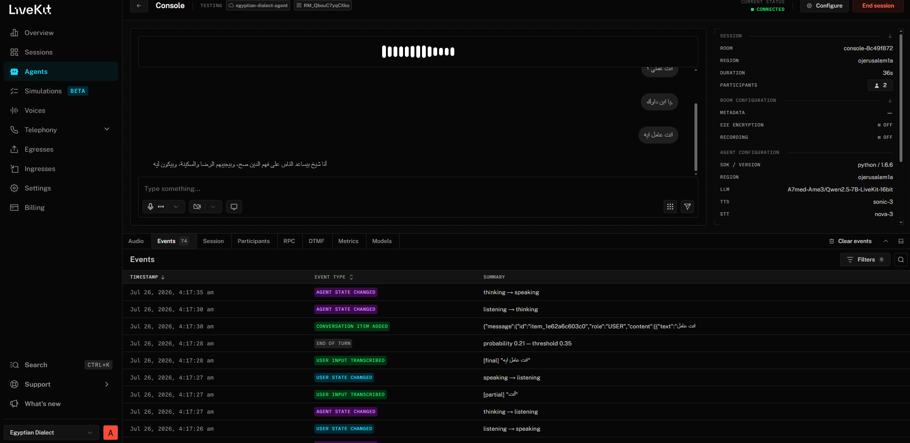
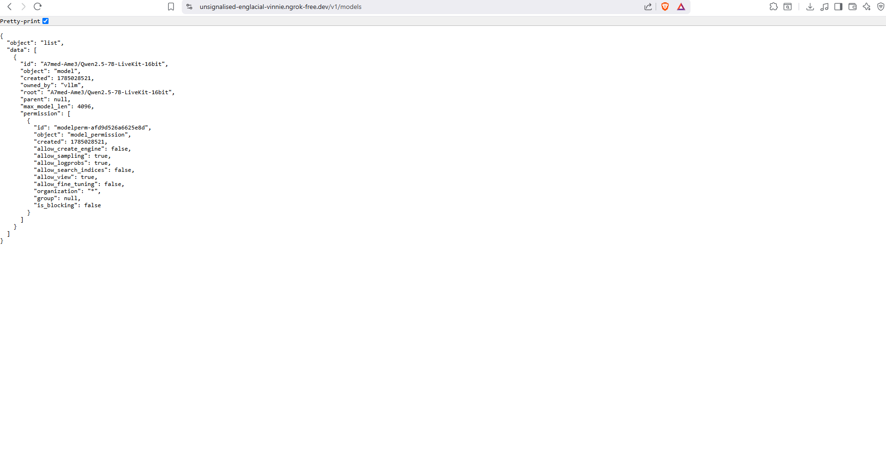

# 🚀 [Tips Hindawi](https://www.tipshindawi.com/) Challenge (June–July) 2026

> 🏆 This repository is my official submission for the [**Tips Hindawi**](https://www.tipshindawi.com/) **Challenge (June–July) 2026**.

## 👤 Participant

| Field            | Value                                            |
| ---------------- | ------------------------------------------------ |
| Full Name        | Ahmed Akram Amer                                 |
| Project Name     | Islamic-QA-Egyptian-Dialect                      |
| GitHub Username  | [Ahmed-7-ML](https://github.com/Ahmed-7-ML)       |
| Challenge Batch  | June–July 2026                                  |
| Training Program | Large Language Models (LLMs) Program             |
| Organization     | [**Edrak for Ai**](https://edrak4ai.com/en) |

---

# 📖 Project Overview

**Islamic-QA-Egyptian-Dialect** is a fine-tuned, low-latency conversational AI assistant that understands and answers Islamic (Aqeedah, Fiqh, Seerah/history, and general) questions naturally in **Egyptian Arabic dialect (العامية المصرية)**.

The project fine-tunes `Qwen2.5-7B-Instruct` on a curated Egyptian-Arabic Islamic Q&A dataset using LoRA/QLoRA, then deploys the result across two production-style serving paths — a merged 16-bit model via **vLLM** and integrates it into a real-time, voice-based conversational agent using the **LiveKit Agents Framework** (Deepgram STT → LLM → Cartesia TTS).

Every technical decision — base model choice, dataset selection, LoRA configuration, and quantization strategy — is documented and justified in [`ARCHITECTURE.md`](./ARCHITECTURE.md), alongside a systematic base-model-vs-fine-tuned-model evaluation covering latency, VRAM, and dialect consistency.

---

# ✨ Features

* Fine-tuned LLM that answers Islamic questions fluently in natural Egyptian dialect instead of formal Modern Standard Arabic.
* Parameter-efficient fine-tuning (LoRA/QLoRA via Unsloth) — trainable on limited/free-tier GPU memory.
* Deployment-ready model formats: a merged 16-bit model for **vLLM** serving.
* Real-time voice agent built on **LiveKit Agents**, combining Deepgram STT, the fine-tuned LLM, Cartesia TTS, and Silero VAD into a full speech-to-speech pipeline.
* Systematic **base vs. fine-tuned** evaluation harness measuring TTFT, TPS, output length, and peak VRAM across 16 held-out questions spanning 4 intent categories.
* Documented, justified technical decisions for every stage of the pipeline (see `ARCHITECTURE.md`).

---

# 🛠️ Technologies Used

* **Base Model**: `Qwen2.5-7B-Instruct` (Qwen, Apache 2.0)
* **Fine-Tuning**: LoRA / QLoRA (4-bit), [Unsloth](https://github.com/unslothai/unsloth), TRL `SFTTrainer`
* **Quantization**: GGUF (`q4_k_m`) via Unsloth's native GGUF export
* **Serving**: vLLM (OpenAI-compatible API), llama.cpp / Ollama (GGUF)
* **Real-Time Voice Pipeline**: [LiveKit Agents Framework](https://docs.livekit.io/agents/), Deepgram (STT, `nova-3`), Cartesia (TTS, `sonic-3`), Silero (VAD)
* **Data & Evaluation**: Hugging Face Hub (`datasets`, `transformers`), pandas, `sentence-transformers` (semantic similarity for quantization-loss comparison)
* **Language**: Python

---

# ⚙️ Installation

```bash
# Clone the repository
git clone https://github.com/Ahmed-7-ML/Islamic-QA-Egyptian-Dialect.git
cd Islamic-QA-Egyptian-Dialect

# Install Python dependencies
pip install -r requirements.txt
```

Create a `.env` file in the project root with the credentials needed for the LiveKit voice agent:

```env
LIVEKIT_URL=
LIVEKIT_API_KEY=
LIVEKIT_API_SECRET=
DEEPGRAM_API_KEY=
CARTESIA_API_KEY=
OPENAI_API_KEY=EMPTY
```

The fine-tuning and evaluation notebook (`qwen3-8b-islamic-qa-updated.ipynb`) is designed to run on a GPU-backed environment (Kaggle/Colab or equivalent) and handles model loading, training, quantization, and benchmarking end-to-end.

---

# 🚀 Usage

**1. Fine-tune and export the model** — open the notebook and run the cells in order: base model loading → LoRA fine-tuning → merge → GGUF quantization. Adapters, the merged model, and the dataset are also published on Hugging Face (see links below).

**2. Serve the model** — either:

- Serve the merged 16-bit model with **vLLM** (OpenAI-compatible endpoint), or
- Run the **GGUF `q4_k_m`** model locally via `llama-cpp-python` or Ollama for lighter-weight inference.

**3. Run the voice agent** — with the model server running, start the LiveKit agent worker:

```bash
python agent.py dev
```

Then connect to the agent through the [LiveKit Agents Playground](https://agents-playground.livekit.io/) (or my own frontend) using your `LIVEKIT_URL`, and start talking — the agent listens, thinks, and replies in Egyptian dialect, in voice.

**4. Run the evaluation suite** — the notebook's evaluation section runs the full base-vs-fine-tuned benchmark.

---

# 📸 Demo

🎥 **Live Demo (video)**: [Watch on Google Drive](https://drive.google.com/file/d/1BRYskrCp0Qf4y649rONq1XTpNDMA57-9/view?usp=sharing)

**LiveKit console — live end-to-end voice test** (Egyptian dialect STT → LLM → TTS pipeline):



**vLLM deployment check** (OpenAI-compatible `/v1/models` endpoint serving the fine-tuned model):



Additional training/evaluation charts and screenshots are available in [`ARCHITECTURE.md`](./ARCHITECTURE.md).

---

# 📈 Results

A full base-model-vs-fine-tuned-model evaluation was run across 16 held-out questions spanning 4 intent categories (`aqeedah`, `fiqh`, `history`, `general`):

| Metric                     | Base Model      | Fine-Tuned Model | Change                            |
| -------------------------- | --------------- | ---------------- | --------------------------------- |
| Total Inference Time (sec) | 12.75           | **7.68**   | ~40% faster                       |
| Output Tokens              | 189.6           | **112.3**  | ~41% shorter, more direct answers |
| TPS (tok/sec)              | **14.89** | 14.58            | ~unchanged                        |
| TTFT (sec)                 | **0.29**  | 0.39             | ~34% slower                       |
| Peak VRAM (MB)             | 14,157          | **14,168** | negligible difference             |

**Key takeaway**: fine-tuning did not speed up raw token-by-token decoding, but it did teach the model to answer more concisely and directly in natural Egyptian dialect — cutting total response time by ~40% end-to-end, which matters most for a real-time voice assistant. TTFT was slightly higher for the fine-tuned model, a finding reported here rather than hidden, with further investigation flagged as future work.

Full methodology, per-intent breakdowns, and the honest interpretation of these numbers (including what *didn't* improve) are documented in [`ARCHITECTURE.md`](./ARCHITECTURE.md).

### Hugging Face Links

* **LoRA Adapter**: [A7med-Ame3/qwen2.5_lora_model](https://huggingface.co/A7med-Ame3/qwen2.5_lora_model)
* **Merged Model (16-bit)**: [A7med-Ame3/Qwen2.5-7B-LiveKit-16bit](https://huggingface.co/A7med-Ame3/Qwen2.5-7B-LiveKit-16bit)
* **Updated Dataset**: [A7med-Ame3/islamic-qa-egyptian](https://huggingface.co/datasets/A7med-Ame3/islamic-qa-egyptian)

---

# 🔮 Future Improvements

* **Custom Egyptian-Dialect TTS** — Develop a locally fine-tuned TTS model on Egyptian dialect, voiced as a sheikh, to make the assistant's tone appropriate to the subject.
* **Multi-User Session Memory** — Add per-session memory so the assistant tracks and recalls each concurrent user's own conversation context.
* **Cloud-Native Deployment** — Move deployment to managed GPU cloud platforms such as RunPod or Modal for scalable, production-grade hosting.
* **Deeper Quantization** — Apply further quantization to shrink model size and GPU memory consumption for cheaper, faster inference.
* **Latency–Accuracy Trade-offs** — Systematically study the trade-off between response speed and answer quality/accuracy across quantization levels.

# 📚 About the Challenge

This project was developed as part of the [**Tips Hindawi**](https://www.tipshindawi.com/) **Challenge (June–July) 2026**.

[Tips Hindawi](https://www.tipshindawi.com/) is the internships department of [**Edrak for Ai**](https://edrak4ai.com/en), and the challenge encourages participants to build real-world projects, apply practical skills, and showcase their work through GitHub.

For more information about the challenge, training programs, and upcoming batches, visit the official [Tips Hindawi](https://www.tipshindawi.com/) website.

---

# 📄 License

This project is shared for educational and portfolio purposes.
